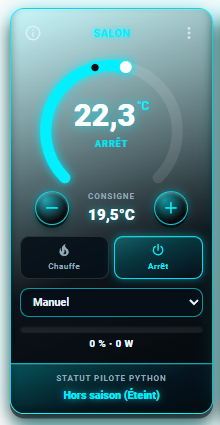
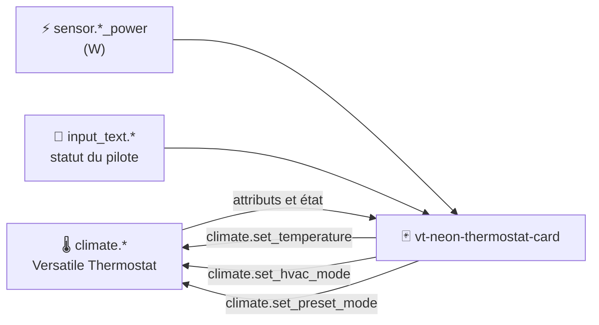

<div align="center">

# 🌡️ VT Neon Thermostat Card

**Une carte thermostat néon pour Home Assistant, pensée pour [Versatile Thermostat](https://github.com/jmcollin78/versatile_thermostat).**
Jauge circulaire, consigne, modes, preset, puissance et statut de votre pilote — en un seul coup d'œil.

[](https://hacs.xyz)
[](CHANGELOG.md)
[](https://www.home-assistant.io)
[](LICENSE)



</div>

---

## 📑 Sommaire

- [✨ Fonctionnalités](#-fonctionnalités)
- [📦 Installation](#-installation)
- [🚀 Démarrage rapide](#-démarrage-rapide)
- [🔍 Comment fonctionne la carte](#-comment-fonctionne-la-carte)
- [⚙️ Configuration](#️-configuration)
- [📐 Mises en page : complète, compacte, horizontale](#-mises-en-page--complète-compacte-horizontale)
- [🧩 Exemples d'intégration](#-exemples-dintégration)
- [🛠️ Dépannage](#️-dépannage)
- [🗺️ Feuille de route](#️-feuille-de-route)
- [🤝 Contribuer](#-contribuer)
- [📄 Licence et crédits](#-licence-et-crédits)

---

## ✨ Fonctionnalités

| | Fonctionnalité | Détail |
|---|---|---|
| 🎯 | **Jauge néon à 270°** | Arc lumineux jusqu'à la température actuelle, point blanc pour la mesure, point sombre pour la consigne. |
| ➕ | **Réglage de la consigne** | Boutons − / + qui respectent `min_temp`, `max_temp` et le pas du thermostat. Un seul appel de service est envoyé après une courte pause. |
| 🔥 | **Modes HVAC** | Boutons Chauffe / Arrêt par défaut, extensibles (clim, auto, ventilation…). |
| 🎚️ | **Presets** | Liste déroulante des presets du thermostat, avec libellés traduits (Manuel, Hors-gel, Éco, Confort, Boost…). |
| ⚡ | **Puissance** | Barre de progression du cycle de chauffe (%) et puissance instantanée (W). |
| 🐍 | **Statut du pilote** | Bloc dédié qui affiche le texte de n'importe quelle entité (`input_text`, `sensor`, `text`). Idéal pour un script Python ou une automatisation. |
| 🪟 | **Alertes** | Badges « fenêtre ouverte », « délestage actif » et « mode sécurité ». |
| ℹ️ | **Panneau d'informations** | Le bouton ⓘ affiche l'état détaillé du thermostat sans quitter le dashboard. |
| 📐 | **3 mises en page** | `full`, `compact` et `horizontal` pour s'adapter à toutes les grilles et tous les stacks. |
| 🟠 | **Couleur dynamique** | La carte passe de la couleur néon à l'orange pendant la chauffe. Les deux teintes sont configurables. |
| 🧰 | **Éditeur visuel** | Configuration complète depuis l'interface, sans écrire de YAML. |
| 🌍 | **Français et anglais** | La langue suit celle de Home Assistant. |

## 📦 Installation

### Via HACS (recommandé)

1. Ouvrez **HACS → Interface** (ou **Frontend** selon votre version).
2. Menu ⋮ en haut à droite → **Dépôts personnalisés**.
3. Ajoutez `https://github.com/VOTRE_PSEUDO/vt-neon-thermostat-card` avec la catégorie **Dashboard** (ou **Lovelace**).
4. Recherchez **VT Neon Thermostat Card**, puis cliquez sur **Télécharger**.
5. Rechargez votre navigateur (Ctrl + F5).

### Installation manuelle

1. Téléchargez `vt-neon-thermostat-card.js` depuis la [dernière version](https://github.com/VOTRE_PSEUDO/vt-neon-thermostat-card/releases/latest).
2. Copiez-le dans `/config/www/`.
3. Dans **Paramètres → Tableaux de bord → ⋮ → Ressources**, ajoutez :

   | URL | Type |
   |---|---|
   | `/local/vt-neon-thermostat-card.js` | Module JavaScript |

4. Rechargez votre navigateur.

> 💡 Si vous venez de HACS, la ressource est ajoutée automatiquement sous `/hacsfiles/vt-neon-thermostat-card/vt-neon-thermostat-card.js`.

## 🚀 Démarrage rapide

Ajoutez une carte **Manuelle** à votre dashboard :

```yaml
type: custom:vt-neon-thermostat-card
entity: climate.salon
```

Version complète, avec puissance et statut du pilote :

```yaml
type: custom:vt-neon-thermostat-card
entity: climate.salon_degc
name: SALON
powerEntity: sensor.pilote_radiateur_salon_power
statusEntity: input_text.salon_statut_calcul_python
set_current_as_main: true
disable_window: false
```

Vous pouvez aussi chercher **VT Neon Thermostat Card** dans le sélecteur de cartes et tout régler avec l'éditeur visuel.

## 🔍 Comment fonctionne la carte

La carte **lit** l'état d'une entité `climate` (idéalement un Versatile Thermostat) et **commande** cette même entité avec les services standard de Home Assistant. Elle ne stocke rien et ne crée aucune entité.



### Anatomie de la carte

| Zone | Icône | Rôle | Source des données |
|---|---|---|---|
| **En-tête** | ℹ️ ⋮ | Nom de la pièce. ⓘ ouvre le panneau d'informations, ⋮ (ou un clic sur le nom) ouvre la fenêtre détaillée de Home Assistant. | `name` ou `friendly_name` |
| **Alertes** | 🪟 ⚠️ 🛡️ | Badges affichés uniquement quand une condition est active. | `window_state`, `overpowering_state`, `security_state` |
| **Jauge** | 🎯 | Arc lumineux jusqu'à la température actuelle. ⚪ point blanc = mesure, ⚫ point sombre = consigne. | `current_temperature`, `temperature`, `min_temp`, `max_temp` |
| **Valeur centrale** | 🔢 | Température en grand et état sous le chiffre (CHAUFFE, REPOS, ARRÊT…). | `current_temperature` (ou `temperature` si `set_current_as_main: false`), `hvac_action` |
| **Consigne** | ➖ ➕ | Réglage par pas. La commande part 600 ms après le dernier appui. | `temperature`, `target_temp_step` |
| **Modes** | 🔥 ⏻ | Bouton actif mis en surbrillance. | `hvac_modes`, état de l'entité |
| **Preset** | 🎚️ | Liste déroulante, masquée si le thermostat n'a pas de preset. | `preset_modes`, `preset_mode` |
| **Puissance** | ⚡ | Barre de progression et texte « % - W ». | `on_percent` (ou `power_percent`) et `powerEntity` |
| **Statut** | 🐍 | Texte libre fourni par votre script ou automatisation. | `statusEntity` |

### Règles d'affichage utiles à connaître

- 🟠 **Couleur** : l'accent passe à `heat_color` (orange) quand `hvac_action` vaut `heating`, sinon il reste à `color`.
- 🔄 **Valeur principale** : avec `set_current_as_main: true` (défaut), le grand chiffre est la température mesurée et la consigne est en dessous. Avec `false`, c'est l'inverse.
- 🪟 **Fenêtre** : `disable_window: true` supprime le badge et la ligne « Fenêtre ouverte » du panneau.
- 🔎 **Attributs** : les attributs propres à Versatile Thermostat (`window_state`, `on_percent`, `overpowering_state`…) sont cherchés au premier niveau puis dans `specific_states`.
- 🚫 **Indisponible** : si l'entité est `unavailable`, la carte est grisée et non cliquable.

### Le bloc « statut pilote »

`statusEntity` accepte n'importe quelle entité dont l'état est un texte : `input_text`, `sensor`, `text`. Votre script (Python, AppDaemon, Pyscript, automatisation…) écrit simplement un message lisible, par exemple :

```yaml
service: input_text.set_value
target:
  entity_id: input_text.salon_statut_calcul_python
data:
  value: "Chauffe 62 % (cycle TPI)"
```

Le titre du bloc se change avec `status_label`. Attention : un `input_text` est limité à 255 caractères.

## ⚙️ Configuration

### Options principales

| Option | Type | Défaut | Description |
|---|---|---|---|
| `type` | string | **requis** | `custom:vt-neon-thermostat-card` |
| `entity` | string | **requis** | Entité `climate.*` à piloter. |
| `name` | string | nom de l'entité | Titre affiché dans l'en-tête. |
| `layout` | string | `full` | `full`, `compact` ou `horizontal`. |
| `powerEntity` | string | – | Capteur de puissance en W. Alias : `power_entity`. |
| `statusEntity` | string | – | Entité dont l'état est affiché dans le bloc statut. Alias : `status_entity`. |
| `status_label` | string | « Statut pilote Python » | Titre du bloc statut. |
| `set_current_as_main` | bool | `true` | Température mesurée en grand, consigne en dessous. |
| `disable_window` | bool | `false` | Désactive le badge et l'information « fenêtre ouverte ». |

### Options d'affichage

| Option | Type | Défaut | Description |
|---|---|---|---|
| `color` | string | `#00e5ff` | Couleur néon principale (hexadécimal). |
| `heat_color` | string | `#ff8a1f` | Couleur pendant la chauffe. Mettez la même valeur que `color` pour la désactiver. |
| `decimals` | number | `1` | Nombre de décimales affichées. |
| `hvac_modes` | list | `[heat, off]` | Modes proposés en boutons (parmi ceux que le thermostat supporte). |
| `preset_labels` | map | – | Remplace le libellé d'un preset, par exemple `eco: Économie`. |
| `hide_preset` | bool | `false` en `full`, `true` sinon | Masque la liste des presets. |
| `hide_status` | bool | `false` en `full`, `true` sinon | Masque le bloc statut. |
| `hide_power` | bool | `false` | Masque la barre de puissance. |
| `hide_modes` | bool | `false` | Masque les boutons de mode. |

### Options de réglage

| Option | Type | Défaut | Description |
|---|---|---|---|
| `min` | number | `min_temp` du thermostat | Borne basse de la jauge et de la consigne. |
| `step` | number | pas du thermostat (sinon `0.5`) | Incrément des boutons − / +. |
| `max` | number | `max_temp` du thermostat | Borne haute de la jauge et de la consigne. |
| `max_power` | number | – | Puissance maximale en W. Sert à calculer le % de la barre quand le thermostat n'expose pas de pourcentage. |

## 📐 Mises en page : complète, compacte, horizontale

| Mise en page | Usage idéal | Contenu |
|---|---|---|
| 🖥️ **`full`** (défaut) | Grille de 2 colonnes, page dédiée au chauffage. | Tout : en-tête, jauge, consigne, modes, preset, puissance, statut. |
| 📱 **`compact`** | `horizontal-stack` de 2 ou 3 cartes, petits panneaux, tablettes murales. | Jauge réduite, consigne, modes en icônes, barre de puissance. Preset et statut masqués par défaut. |
| ➖ **`horizontal`** | `vertical-stack`, liste de pièces, bandeau. | Une seule ligne : mini-jauge, nom et état, consigne, modes en icônes, barre de puissance. |

Dans les mises en page `compact` et `horizontal`, vous pouvez réafficher un bloc masqué en le demandant explicitement, par exemple `hide_preset: false` (pertinent surtout en `compact`).

<!--
  Vous pouvez ajouter ici vos propres captures d'écran :
    
-->

## 🧩 Exemples d'intégration

### Grille de quatre pièces

```yaml
type: grid
square: false
columns: 2
cards:
  - type: custom:vt-neon-thermostat-card
    entity: climate.salon_degc
    name: SALON
    powerEntity: sensor.pilote_radiateur_salon_power
    statusEntity: input_text.salon_statut_calcul_python
  - type: custom:vt-neon-thermostat-card
    entity: climate.sejout_degc
    name: SALLE À MANGER
    powerEntity: sensor.pilote_radiateur_sam_power
    statusEntity: input_text.sam_statut_calcul_python
```

### Cartes compactes côte à côte

```yaml
type: horizontal-stack
cards:
  - type: custom:vt-neon-thermostat-card
    layout: compact
    entity: climate.salon_degc
    name: SALON
    powerEntity: sensor.pilote_radiateur_salon_power
  - type: custom:vt-neon-thermostat-card
    layout: compact
    entity: climate.sejout_degc
    name: SAM
    powerEntity: sensor.pilote_radiateur_sam_power
```

### Liste verticale de lignes horizontales

```yaml
type: vertical-stack
cards:
  - type: custom:vt-neon-thermostat-card
    layout: horizontal
    entity: climate.salon_degc
    name: SALON
    powerEntity: sensor.pilote_radiateur_salon_power
  - type: custom:vt-neon-thermostat-card
    layout: horizontal
    entity: climate.parent_degc
    name: PARENTS
    powerEntity: sensor.pilote_radiateur_parent_power
```

### Changer les couleurs et les libellés

```yaml
type: custom:vt-neon-thermostat-card
entity: climate.emma_degc
name: CHAMBRE EMMA
color: "#b388ff"
heat_color: "#ff5252"
status_label: Pilote de chauffe
preset_labels:
  none: Auto
  eco: Économie
```

D'autres exemples prêts à copier se trouvent dans le dossier [`examples/`](examples).

## 🛠️ Dépannage

| Symptôme | Cause probable | Solution |
|---|---|---|
| « Custom element doesn't exist » | La ressource n'est pas chargée. | Vérifiez l'URL dans **Ressources** (type *Module JavaScript*), puis Ctrl + F5. |
| La jauge affiche « – » | `current_temperature` absent. | Vérifiez l'entité dans **Outils de développement → États**. |
| Pas de barre de puissance | Le thermostat n'expose ni `on_percent` ni `power_percent`, et `powerEntity` est absent. | Renseignez `powerEntity`, éventuellement avec `max_power`. |
| Le preset n'apparaît pas | Pas de `preset_modes`, ou masqué en `compact` / `horizontal`. | Utilisez `layout: full` ou `hide_preset: false`. |
| Le nom est tronqué | Carte étroite. | Raccourcissez `name` (par exemple « SAM »). |
| Bouton de mode absent | Le mode n'est pas supporté par le thermostat. | Vérifiez `hvac_modes` dans les attributs de l'entité. |
| Les modifications du JS ne s'affichent pas | Cache du navigateur. | Ctrl + F5, ou ajoutez `?v=1.0.0` à l'URL de la ressource. |

## 🗺️ Feuille de route

- [ ] Réglage de la consigne en faisant glisser le point sur la jauge
- [ ] Mode « multi-thermostats » (une jauge, plusieurs radiateurs)
- [ ] Actions personnalisables (`tap_action`, `hold_action`)
- [ ] Traductions supplémentaires

Vos idées sont les bienvenues : ouvrez une [issue](https://github.com/VOTRE_PSEUDO/vt-neon-thermostat-card/issues).

## 🤝 Contribuer

1. Forkez le dépôt et créez une branche (`git checkout -b ma-fonctionnalite`).
2. Modifiez `dist/vt-neon-thermostat-card.js` (aucune étape de build n'est nécessaire).
3. Vérifiez la syntaxe avec `node --check dist/vt-neon-thermostat-card.js`.
4. Ouvrez une Pull Request en décrivant le changement et, si possible, avec une capture d'écran.

## 📄 Licence et crédits

Distribué sous licence [MIT](LICENSE).

Cette carte est un projet indépendant, inspiré par la [Versatile Thermostat UI Card](https://github.com/jmcollin78/versatile-thermostat-ui-card) et conçu pour l'intégration [Versatile Thermostat](https://github.com/jmcollin78/versatile_thermostat) de @jmcollin78. Elle n'est affiliée à aucun de ces projets.
